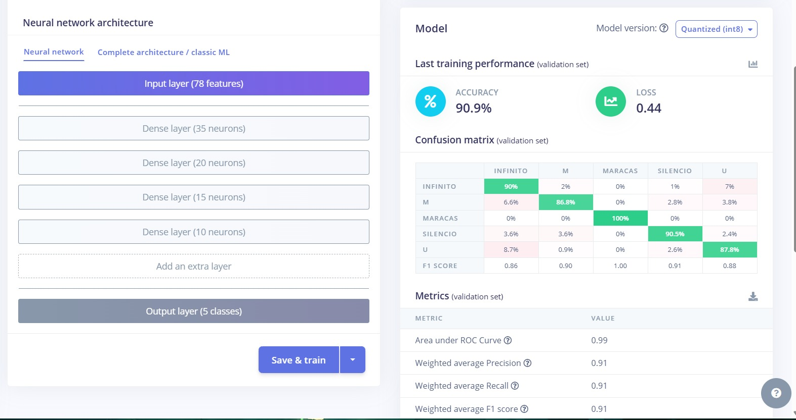

Se está desarrollando un proyecto para el primer corte de la materia INTELIGENCIA ARTIFICIAL EN DISPOSITIVOS MÓVILES Y EMBEBIDOS (cuyos lineamientos se hallan en "C:\Users\mitgar14\Desktop\Ingenieria de Datos e IA - UAO\Semestre 7\IA en Embebidos\Semana #1 - #6\Proyecto\docs\Miniproyecto 1 Tiny ML Ver 2025_01.pdf").

El modelo ya se diseñó y se testeo; actualmente está en proceso de ser desplegado a Arduino (lo cual es un proceso sencillo con TF Lite; ya se puede tomar por hecho de que ya está).

Dicho modelo se enmarca dentro de un contexto de una aplicación "pedagógica" que consiste en una especie de simulación de maestro de orquestas  (tener en cuenta que a esta versión le falta todavía 1 gesto -silencio no se cuenta-), en donde cada gesto debe generar una acción sobre la aplicación.

Dicha aplicación podrá reproducir las pistas siguientes (ten en cuenta que vamos a quitar una para que queden 5):

- "C:\Users\mitgar14\Music\beethoven_symphony_no7_2nd-output\stem_cuerdas_graves.mp3"
- "C:\Users\mitgar14\Music\beethoven_symphony_no7_2nd-output\stem_timbales.mp3
- "C:\Users\mitgar14\Music\beethoven_symphony_no7_2nd-output\stem_tutti.mp3" → TODOS LOS INSTRUMENTOS
- "C:\Users\mitgar14\Music\beethoven_symphony_no7_2nd-output\stem_vientos_madera.mp3"
- "C:\Users\mitgar14\Music\beethoven_symphony_no7_2nd-output\stem_vientos_metal.mp3"
- "C:\Users\mitgar14\Music\beethoven_symphony_no7_2nd-output\stem_violines.mp3"

El objetivo es que la aplicación "escuche" los gestos del arduino y la clasificacion del movimiento consiguiente que este genera Y QUE APLIQUE dicha predicción para determinar la pista de audio a escuchar.

---

Yo me encargo de la aplicación: la quiero con una estética moderna, simple, con tonos oscuros. Sin embargo, si necesito obligatoriamente que el diseño de esta esté enmarcado de forma funcional, con patrones de diseño originales (y no típicos del entrenamiento de una IA), que estos patrones sean atípicos.